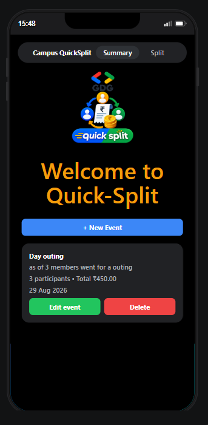
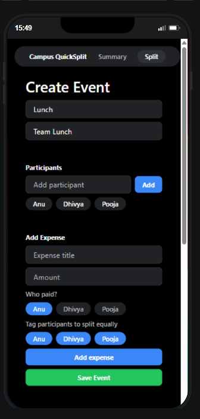
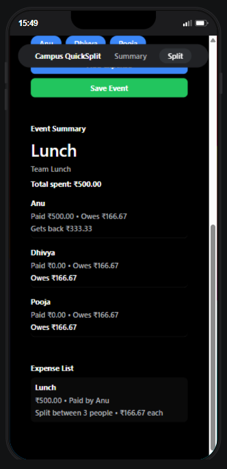

# Campus QuickSplit

Campus QuickSplit is a lightweight expense-splitting app designed for group outings, lunches, and shared costs. It helps users create an event, add participants, log expenses, and instantly view how much each person paid, owes, or should receive back.

This app is built with Expo and React Native and is optimized for quick local testing in the browser when an Android/iOS emulator is not available.

## Features

- Create and save group events
- Add participants by name
- Add multiple expenses with a payer and shared participants
- Split the cost equally among selected people
- View an event summary with per-person pay/owe balances
- Edit existing saved events
- Delete saved events after confirmation
- Store event data locally in AsyncStorage

## App walkthrough

### 1. Landing screen

The home screen shows the app branding and a list of saved events. Users can create a new event or reopen and edit an existing one.



### 2. Create a new event

From the home screen, tap the New Event button to open the event creation flow. The screen allows you to:

- enter the event name
- add a short description
- add participants
- create expenses
- choose who paid and who was involved in the split



### 3. Add participants and expense details

Users can add participant names and then add expenses such as lunch, travel, or food. Each expense includes:

- expense title
- amount
- payer
- selected participants contributing to that cost

The app automatically calculates the equal share for each participant based on the selected group.

### 4. Save and check summary

Once the event is saved, the app shows a complete summary with:

- total spent
- each person's paid amount
- each person's owed amount
- who gets money back and who owes the group
- the expense list with split details



## Typical user flow

1. Open the app and tap New Event.
2. Enter the event name and description.
3. Add all participants.
4. Add one or more expenses.
5. Select who paid and which people should share the bill.
6. Tap Save Event.
7. Review the summary and balances.
8. Edit or delete the event later from the home screen.

## Project setup

### Install dependencies

```bash
npm install
```

### Run the app

For a browser-based local run:

```bash
npm run web
```

You can also use:

```bash
npx expo start --web
```

> In environments without an Android/iOS simulator, the web option is the most reliable way to run and test the app.

## Local storage behavior

The app keeps event data in AsyncStorage using a local key for saved events. This means:

- previously created events remain available after reopening the app
- users can edit saved events without losing their current data
- deleting a saved event removes it from local storage and refreshes the list on the home screen

## Tech stack

- Expo
- React Native
- TypeScript
- AsyncStorage
- Expo Router

## Screenshots

- [Landing screen](app_demo_screens/landing.png)
- [Create event screen](app_demo_screens/split_1.png)
- [Event summary](app_demo_screens/split_2.png)

## Notes

This project is a simple, user-friendly expense-splitting app intended for group cost tracking. It focuses on quick event setup and clear settlement summaries for groups sharing expenses.
